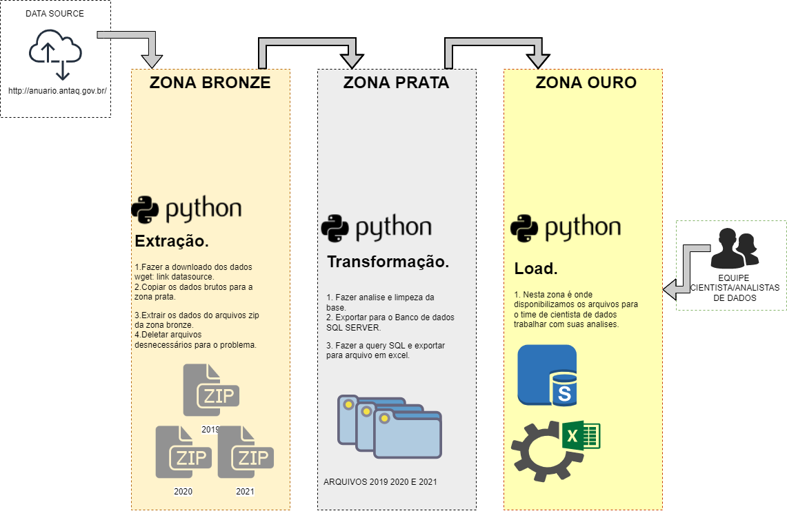

# Desafio para engenheiro de dados iniciante
<h1 align="center">

Projeto: Engenheiro de dados SFIEC– Jammesson Cabral

</h1>

# 📖 Sobre  Etapas do projeto

- <a href="#Data-Lake">Data-Lake</a>
- <a href="#extração">Extração</a>
- <a href="#transformação">Transformação</a>
- <a href="#carregar">Carregar</a>
- <a href="#analises">Analises</a>

# Data-Lake 

Sobre a estrutura do Data Lake definir trabalhar com 3 zonas nomeadas como (Bronze, Prata e Ouro).
Estas zonas seviram para organizar os arquivos dentro delas, bem como definir permissões de acesso para equipe.
Segue estrutura de cada zona:

-🥉 **Zona Bronze**: Local onde vamos guardar dados brutos completos de como eles são feito a extração.

-🥈 **Zona Prata**: Local onde vamos fazer as transformações necessarias para o projeto bem como limpeza de arquivos que não seram utilizados.

-🥇 **Zona Ouro**: Local onde vamos disponibilizar arquivos já tratados para equipe de Ciencia de dado / Analista de dados fazerem seus trabalhos.

<h1 align="center">

</h1>

# Extração
- 
Sobre a extração verificamos que o link os dados do Anuário Estatísticos da ANTAQ (Agência Nacional de Transportes Aquáticos) existia um padrão a ser seguido, então entendemos que padrão foi, onde o link para download é o mesmo só muda uma string que seria o ano referente ao ano em questão. Com esse padrão em mãos, definimos uma lista com os anos que precisavam ser extraidos, e utilizamos o wget para fazer o download dos arquivos .zip para a zona bronze mudando apenas a variavel chave do link o [ANO] 

Nesta Etapa também já copiamos todos os arquivos .zip para pasta prata e fizendo o unzip, deletamos os arquivos que não seriam utilizados pela equipe de ciência de dados bem como os arquivos zip, deixando assim só os arquivos atracacao.txt e carga.txt de cada ano.  

# Transformação

- Nesta etapa vamos começar a fazer as limpezas dos dados.
Carregamos todos os arquivos do ano de 2019 2020 e 2021 conforme a equipe solicitou em um pandas dataframe.
- Verificamos que algumas colunas no farmato datatime não tinham sida reconhecidas como padrão no dataframe.
- Alteramos as colunas de datatime no dataframe.
- Verificamos algumas linhas nulas, mas não excluimos nenhuma pois não sabemos quais variaveis são importantes para a analise, não foi definido se a gente coloca algum dado padrão para esses campos nulos então optamos por deixar.

# Carregar

- Nesta etapa vamos carregar os dados de um dataframe para o SQL SERVER.
- Após tentar importar os dados para o SQL Server verificamos que os campos nulos estavam dando erro, então mudando os campos do dataframe NaN, para None onde conseguimos fazer com que o banco enteda que esse campo é nulo.

# Analises

- Verificamos na hora de inserir os dados da tabela Atracacao_fato para o SQL Server, demorava em torno de 20 minutos, esta tabela tem o total de 232.944 linhas e 18 colunas, enquanto a tabela carga_fato tem 6.479.692 linhas e 16 colunas, ou seja iriamos passar em torno de 9 ou mais horas.
- Sabemos que tudo depende da força do hardware tanto o que está do lado do servidor SQL como o que está processando os dados e enviando para o SQL então talvez uma maquina mais robusta diminuiria este tempo.
- Também verificamos que pelo fato dessa quantidade de linhas, já temos uma quantidade significante para serem inseridos e analisados, verificando que o processamento paralelo poderia ser uma boa alternativa como spark utilizando os arquivos parquet ou avro.

